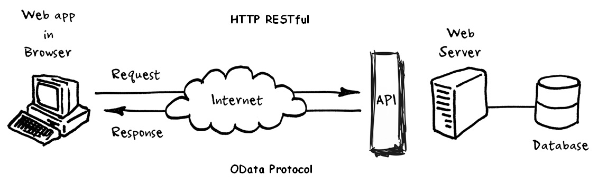

<h2 align="center">
  Flask OData Server<br/>
</h2>
<div align="center">
  
</div>
<br/>
<center>
</center>

**Author**: Max (Leiwen) Lin  
**GitHub URL**: [flask-odata-server](https://github.com/linleiwen/flask-odata-server)


## Introduction

🚀 **Empowering Data Sharing with Flask OData Project** 🚀

In the digital age, data sharing and interoperability are key to driving innovation and solving complex challenges. Proudly presenting my latest open-source endeavor - a service implemented using the Python Flask framework, compliant with the OData (Open Data Protocol) standard. This project not only showcases my passion for technology but also embodies my commitment to promoting data transparency and accessibility.

**Note**: This project is intended for demonstration purposes only and is not suitable for production use.

## Features

- **OData Standard Compliance**: Utilizes the Open Data Protocol to enable efficient and standardized data exchange through simple HTTP requests for creating, reading, updating, and deleting (CRUD) operations.
- **Python Flask Framework**: Built on the clear, flexible, and scalable Flask framework, making it accessible for both developers and non-technical users to query and manipulate data.
- **Cross-Platform Data Integration**: Designed to empower enterprises and developers with the ability to integrate data across different platforms, enhancing data processing efficiency.
- **Community-Driven**: The project is open-source, encouraging contributions, feedback, and the sharing of ideas to collectively explore the future of data sharing.

## Getting Started

To get started with the Flask OData Server, you'll need Python installed on your system. Follow these steps to set up and run the server:

1. Clone the repository:
   ```
   git clone https://github.com/linleiwen/flask-odata-server.git
   ```
2. Navigate to the project directory:
   ```
   cd flask-odata-server
   ```
3. Install the required dependencies:
   ```
   conda install environment.yml
   ```
4. Start the server:
   ```
   python app.py
   ```

**Important**: This server is a demo and should not be used as production code. It's designed to showcase the capabilities of integrating Flask with OData for educational and demonstration purposes.

## How to Contribute

We welcome contributions of all forms. Here's how you can help:

- **Submit Issues**: Report bugs or suggest new features.
- **Pull Requests**: Submit improvements to the codebase or documentation.
- **Feedback and Ideas**: Share your thoughts on how to make this project even better.

## License

This project is open-source and available under the [MIT License](LICENSE).

## Join Us

🔗 [View Project on GitHub](https://github.com/linleiwen/flask-odata-server)

Join us in shaping the future of open data!
